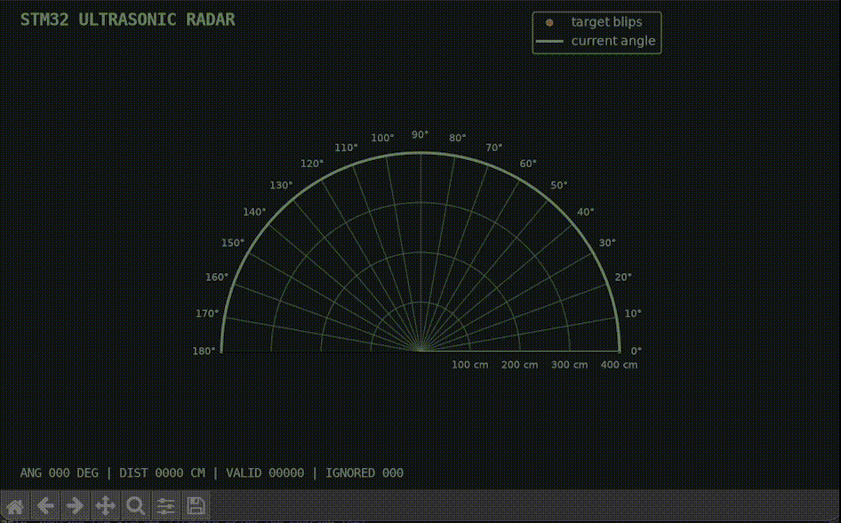
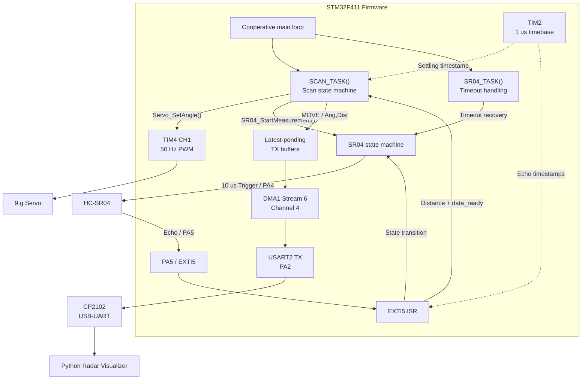

# STM32 Ultrasonic Radar

A bare-metal, register-level ultrasonic scanning system built around an
STM32F411CEU6. An HC-SR04 sensor mounted on a 9 g servo scans objects from
0 to 180 degrees in 5-degree steps, while a Python visualizer renders the
resulting angle-distance samples on a radar-style plot.

The firmware coordinates servo positioning, EXTI-based Echo timing, and
latest-value USART2 DMA telemetry without using the STM32 HAL. Peripherals
are configured through memory-mapped registers to make clock control, pin
routing, timing, interrupt handling, and data movement explicit.

## Demo

### Hardware Scan

<p align="center">
  
</p>

One complete 0°–180°–0° scan cycle at real speed. The sensor moves in
5-degree commanded increments and settles before each measurement.

### Live Radar Visualization

<p align="center">
  
</p>

The visualizer follows `MOVE` packets and plots completed `Ang/Dist`
measurements received through USART2 DMA.

## Key Features

- Direct register-level configuration of STM32F411 peripherals without the
  STM32 HAL.
- Automatic 0-to-180-degree step scan with 5-degree commanded increments and
  a mechanical-settling interval before each measurement.
- Cooperative scan and ultrasonic state machines that keep long waits
  non-blocking, reject out-of-sequence Echo edges, and recover from measurement
  timeouts.
- Interrupt-driven Echo timing using EXTI edge detection and a 1 us TIM2
  timestamp source.
- Hardware PWM servo control using TIM4 channel 1 at 50 Hz.
- USART2 DMA telemetry with separate sending and pending buffers, allowing
  the CPU to avoid polling and writing each transmitted byte.
- Latest-value transmission policy that prioritizes responsive visualization
  over lossless logging.
- Live Python radar-style visualization with configurable display range and
  frame rate.

## Engineering Focus

The STM32 HAL is intentionally bypassed so that peripheral clocks, pin routing,
timer configuration, interrupt flow, and DMA ownership remain visible through
memory-mapped registers. Cooperative scan and measurement state machines keep
mechanical settling and Echo waits non-blocking, while EXTI timestamps Echo
edges and DMA moves prepared telemetry without byte-by-byte CPU polling.

The runtime pipeline is:

```text
servo command -> 150 ms settle -> 10 us Trigger -> Echo edge timestamps
-> validated distance sample -> latest-pending buffer -> USART2 DMA -> PC
```

## Repository Layout

```text
firmware/       Importable STM32CubeIDE project and register-level C firmware
pc_visualizer/  Serial probe, Python radar display, and C++ terminal viewer
docs/           Detailed architecture, wiring documentation, and demo assets
```

## System Architecture



The diagram separates the scan-control, ultrasonic-measurement, and telemetry
paths. See [docs/architecture.md](docs/architecture.md) for state transitions,
execution contexts, module ownership, and the DMA buffering policy.

## Hardware and Pin Assignment

### Hardware List
- STM32F411CEU6 Black Pill
- HC-SR04 ultrasonic sensor
- TPSG90S 9 g analog servo
- CP2102 USB-to-UART adapter
- ST-Link V2 programmer/debugger
- MB102 breadboard power module
- 1 kΩ and 2 kΩ resistors for the HC-SR04 Echo voltage divider
- Breadboard and jumper wires

### Signal Mapping

| STM32 pin | Peripheral function | Connection | Notes |
| --- | --- | --- | --- |
| PA2 | USART2_TX (AF7) | CP2102 RXD | STM32 telemetry output |
| PA3 | USART2_RX (AF7) | CP2102 TXD | Currently unused by firmware |
| PA4 | GPIO output | HC-SR04 Trig | Generates 10 µs Trigger pulse |
| PA5 | EXTI5 input | HC-SR04 Echo through 1 kΩ / 2 kΩ divider midpoint | Captures rising / falling edges |
| PB6 | TIM4_CH1 (AF2) | Servo signal | 50 Hz hardware PWM |

### Electrical Summary

The Black Pill and CP2102 are powered independently through USB. A 9 V / 1 A
adapter powers the MB102, whose 5 V rail supplies the HC-SR04 and servo. All
modules share a common ground, but the separate positive supplies are not tied
together. The HC-SR04 Echo signal reaches PA5 through a 1 kΩ / 2 kΩ divider,
reducing its approximately 5 V output to approximately 3.3 V.

The ST-Link uses SWDIO, SWCLK, 3.3 V target reference, and GND for programming
and debugging; it may be disconnected after the firmware is flashed. See
[docs/wiring.md](docs/wiring.md) for the 2D connection diagram, full power
topology, pre-power checklist, and fault-isolation steps.

## UART Protocol

The STM32 sends line-delimited ASCII telemetry to the PC through USART2 at
115200 baud using 8 data bits, no parity, and 1 stop bit. Each message ends
with `\r\n`.

Communication is currently one-way from the STM32 to the PC. USART2 RX is
configured, but the firmware does not currently process incoming commands.

### Servo Movement

```text
MOVE:<angle>\r\n
```

Example:

```text
MOVE:90
```

A `MOVE` message is queued when the scan state machine commands the servo
toward a new angle. The angle is the commanded servo position in degrees; it
is not a measured physical position because the analog servo provides no
position feedback.

The PC visualizer uses this message to update the sweep line before the
ultrasonic measurement is complete.

### Distance Measurement

```text
Ang:<angle>,Dist:<distance>\r\n
```

Example:

```text
Ang:90,Dist:53
```

A measurement message is queued only after a valid Echo pulse has been
captured and converted to distance. `Ang` is the commanded scan angle in
degrees, and `Dist` is the measured distance in centimeters.

### Failure and Delivery Behavior

If an ultrasonic measurement times out or its Echo pulse width fails
validation, the SR04 state machine returns to `IDLE`. No `Ang/Dist` message is
published for that scan step, and the scan proceeds to the next angle.

If DMA is already transmitting, a newer message may replace the older unsent
message in the CPU-owned pending buffer. The buffer currently owned by DMA is
not modified.

The protocol therefore provides best-effort, latest-value telemetry suitable
for responsive live visualization. It does not guarantee delivery of every
intermediate message and is not suitable for lossless logging.

## Build and Run

### Firmware

The firmware assumes the STM32F411CEU6 reset clock configuration with a
16 MHz HSI system clock. Import the repository's `firmware` directory into
STM32CubeIDE as an existing project, build the `Debug` configuration, and flash
the target through ST-Link. The MCU subsequently boots from internal Flash and
does not require ST-Link for standalone operation.

See [firmware/README.md](firmware/README.md) for the import and local debug
configuration notes.

### PC Visualizer

The visualizer was tested with Python 3.13.0:

```bash
cd pc_visualizer
python3 -m venv .venv
source .venv/bin/activate
python -m pip install -r requirements.txt
```

```bash
python serial_probe.py --port /dev/cu.usbserial-0001
python radar_plot.py --port /dev/cu.usbserial-0001
```

The serial device name may differ between computers. Optional display settings
include `--max-distance` in centimeters and `--fps`:

```bash
python radar_plot.py \
  --port /dev/cu.usbserial-0001 \
  --max-distance 200 \
  --fps 30
```

See [pc_visualizer/README.md](pc_visualizer/README.md) for serial-port notes,
legacy packet compatibility, and host-side file responsibilities.

## Design Tradeoffs

| Decision | Benefit | Cost |
| --- | --- | --- |
| Direct register access instead of STM32 HAL | Makes peripheral clocking, pin routing, register fields, and data movement explicit | Requires more MCU-specific code and manual reference-manual validation |
| Step scan instead of continuous movement | Keeps each commanded angle clearly associated with one distance measurement | Mechanical settling increases the total sweep time |
| EXTI edge interrupts instead of GPIO polling | Allows the main loop to continue while waiting for Echo transitions | Requires ISR/main-loop synchronization and explicit state handling |
| DMA instead of CPU-driven UART transmission | Avoids polling TXE and writing each message byte from the CPU | Requires careful buffer ownership and transfer-state tracking |
| Latest-value pending telemetry instead of a lossless queue | Prevents stale UART traffic from delaying the live display | Intermediate messages may be dropped |

## Validation

The prototype was tested for standalone startup, continuous scanning, live
telemetry, and basic distance consistency.

### Distance Sanity Test

A flat target was placed approximately perpendicular to the sensor at three
reference distances. Five unfiltered measurements were recorded at each
distance near the center of the scan.

| Reference distance | Raw measurements | Mean | Observed range | Mean absolute error |
| ---: | --- | ---: | ---: | ---: |
| 30 cm | 30, 29, 29, 29, 29 cm | 29.2 cm | 29–30 cm | 0.8 cm |
| 60 cm | 61, 59, 59, 57, 61 cm | 59.4 cm | 57–61 cm | 1.4 cm |
| 100 cm | 99, 103, 102, 101, 101 cm | 101.2 cm | 99–103 cm | 1.6 cm |

Across these 15 samples, the overall mean absolute error was approximately
1.27 cm, with a maximum observed individual error of 3 cm.

This test is intended as a functional bench check rather than a calibrated
sensor-accuracy specification. HC-SR04 readings remain sensitive to target
shape, alignment, acoustic reflections, air temperature, and reference-distance
measurement.

### System Tests

| Test | Method | Result |
| --- | --- | --- |
| Standalone boot | Power-cycle the Black Pill after flashing, with the ST-Link disconnected | Firmware resumed scanning from internal Flash |
| Full sweep | Observe one commanded 0°–180°–0° cycle | Approximately 13 seconds at real speed |
| Continuous operation | Run the scanner and visualizer continuously | No lockup observed during a 15-minute run |
| Live telemetry | Observe `MOVE` and `Ang/Dist` updates in the Python visualizer | Sweep and target display remained responsive |
| Distance sanity | Compare five readings at 30, 60, and 100 cm | Overall mean absolute error of approximately 1.27 cm |
| Timeout recovery | Point the sensor toward an out-of-range area | No `Ang/Dist` update was published, while the scan continued to subsequent angles without locking up |

## Limitations and Future Work

| Current limitation | Consequence | Possible improvement |
| --- | --- | --- |
| Timeout and invalid measurements do not produce an explicit telemetry message | The PC cannot distinguish an invalid measurement from a dropped packet, and the visualizer may retain a stale point from an earlier scan | Add an explicit invalid-reading message, such as `Ang:<angle>,Valid:0`, and expire stale points on the host |
| The analog servo provides no position feedback | The displayed angle represents the commanded position rather than a measured physical angle | Calibrate the pulse-to-angle mapping or use a feedback servo, encoder, or external position sensor |
| Latest-value telemetry may replace unsent pending messages | The system cannot preserve a complete historical log or determine an exact packet-loss rate | Add sequence numbers and provide an optional ring-buffer-based lossless logging mode |
| Each angle currently uses a single ultrasonic measurement | Individual readings remain sensitive to outliers, acoustic reflections, target orientation, and environmental conditions | Take multiple measurements per angle and apply median filtering or bounded outlier rejection, with the tradeoff of a slower sweep |
| The prototype uses breadboard wiring and a temporary mechanical fixture | Jumper wires may loosen, become tangled, or mechanically influence sensor movement, limiting portability and repeatability | Move the circuit to perfboard or a PCB, add fixed connectors and cable management, and use a rigid sensor bracket |

## License

Original project code and documentation are available under the
[MIT License](LICENSE), Copyright (c) 2026 Justice Chan.

STM32CubeIDE-generated files retain their embedded STMicroelectronics copyright
and license notices. See [THIRD_PARTY_NOTICES.md](THIRD_PARTY_NOTICES.md) for
the file list and scope.
