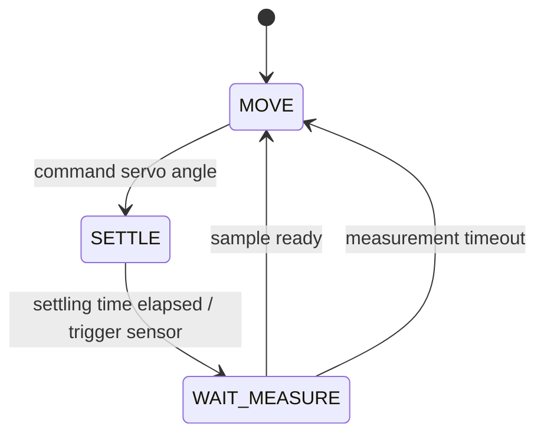
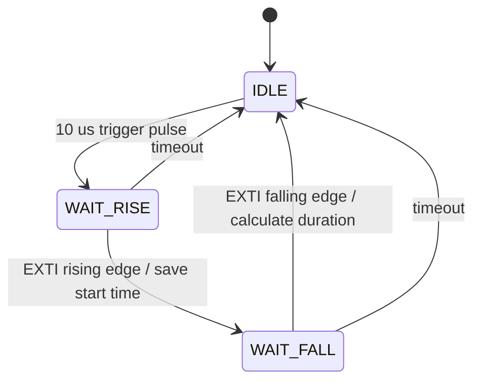

# Firmware Architecture

## Module Responsibilities

| Module | Responsibility |
| --- | --- |
| `firmware/Src/main.c` | Initializes peripherals and repeatedly advances the cooperative tasks |
| `firmware/Src/scan.c` | Owns the servo scan state machine, angle progression, and latest-pending telemetry buffers |
| `firmware/Src/sr04.c` | Owns HC-SR04 Trigger/Echo control, the measurement state machine, timeout handling, and EXTI5 ISR |
| `firmware/Src/timer.c` | Configures the TIM2 microsecond timebase and TIM4 channel 1 servo PWM; maps angles to pulse widths |
| `firmware/Src/uart.c` | Configures USART2 and DMA1 Stream 6, then starts non-blocking string transfers |
| `firmware/Inc/stm32f411_reg.h` | Defines the register layouts, peripheral base addresses, and typed memory-mapped access points |
| Startup and linker files | Define reset startup, memory regions, and placement of code and data in Flash and RAM |
| `pc_visualizer/` | Parses serial telemetry and renders the host-side live radar display |

The ownership boundaries matter: `scan.c` decides *when* work happens,
`sr04.c` decides whether a measurement is valid, and `uart.c` only moves an
already prepared message. This keeps control flow, sensor acquisition, and data
transport independently understandable.

## Execution Contexts

The firmware has three execution contexts with deliberately small ownership
boundaries.

| Context | Responsibilities |
| --- | --- |
| Main loop | Advances scan and timeout state machines; formats telemetry |
| EXTI5 ISR | Captures Echo edges, validates pulse width, publishes a sample |
| DMA hardware | Moves a prepared string buffer into USART2 without CPU polling |

The PC visualizer is a separate host-side process. It parses UART packets,
retains the latest distance for each angle, and redraws at a fixed frame rate.

## Scan State Machine

`MOVE` updates TIM4 CCR1 through `Servo_SetAngle()`. `SETTLE` uses TIM2 as a
non-blocking timestamp rather than occupying the CPU with a delay loop. Once the
servo is expected to be stable, the scan task starts exactly one HC-SR04
measurement and waits for the sensor state machine to finish.

## Ultrasonic Measurement State Machine

TIM2 runs at 1 MHz, so one timer count represents one microsecond. Unsigned
subtraction is used for elapsed-time calculations, which also handles one
natural timer wraparound correctly.

The ISR only performs edge classification, timestamp capture, range validation,
and publication of the completed sample. String formatting and UART scheduling
remain in the main-loop context.

## PWM Servo Control

TIM4 runs with a 1 MHz counter and a 20,000-count auto-reload period, producing
a 50 Hz PWM signal. TIM4 channel 1 drives PB6 in PWM mode 1. A CCR1 value from
1,000 to 2,000 selects a pulse width from 1.0 to 2.0 ms and is mapped to the
requested 0-180 degree software angle.

The mapping is intentionally treated as a command rather than measured
position: the analog servo provides no position feedback to the MCU.

## DMA Telemetry Policy

Two string buffers prevent the CPU from modifying memory currently read by DMA.
A pending flag records whether the current write buffer contains a message that
has not yet started transmission.

When DMA is idle, the TX task starts transmission from the pending buffer and
switches CPU ownership to the other buffer. While DMA is busy, newer telemetry
may replace an older pending message. This is a deliberate latest-value policy:
the visualizer benefits more from current scan state than from replaying stale
packets.

This policy is appropriate for visualization but would not be suitable for
lossless logging or command acknowledgements. Those applications would require
a ring buffer, queue, or explicit flow control.

## Transferable Embedded Concepts

- Enabling peripheral clocks before accessing a peripheral
- Mapping pins through GPIO modes and alternate-function selection
- Converting timing requirements into prescaler, auto-reload, and compare values
- Keeping interrupt handlers short and moving presentation work to task context
- Separating control flow (state machines) from data movement (DMA)
- Defining an intentional policy for overload, buffering, and dropped data
- Verifying register addresses and bit fields against the reference manual
