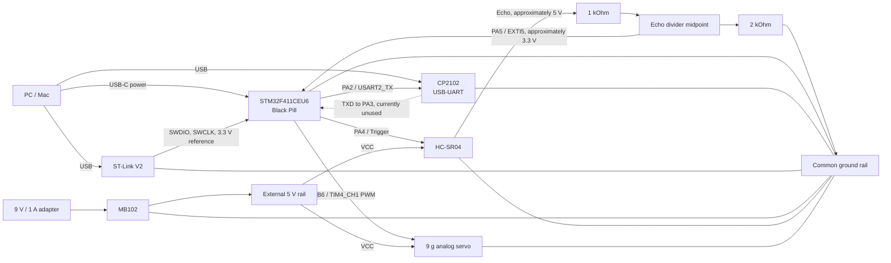

# Wiring Guide

This document describes the tested prototype wiring. Make all connections with
power removed, then complete the pre-power checks before reconnecting power.

## Connection Diagram



This is a logical connection diagram, not a breadboard-row map. Physical row
numbers and rail continuity depend on the breadboard and board orientation, so
each connection should still be confirmed with continuity mode.

## Signal Connections

| Source | Destination | Purpose |
| --- | --- | --- |
| Black Pill PA2 | CP2102 RXD | USART2 telemetry from STM32 to PC |
| Black Pill PA3 | CP2102 TXD | USART2 receive path; currently unused by firmware |
| Black Pill PA4 | HC-SR04 Trig | 10 us ultrasonic trigger pulse |
| HC-SR04 Echo | 1 kOhm resistor | Upper leg of the Echo voltage divider |
| Divider midpoint | Black Pill PA5 | 3.3 V EXTI5 Echo input |
| Divider midpoint | 2 kOhm resistor, then GND | Lower leg of the Echo voltage divider |
| Black Pill PB6 | Servo signal | TIM4 channel 1 PWM output |

UART uses crossed signal names: the STM32 transmitter connects to the CP2102
receiver. The CP2102 power pins are not connected to the Black Pill.

## Power Connections

The prototype uses separate positive supplies with one common ground:

```text
Black Pill USB-C ----------------------> Black Pill power
CP2102 USB ----------------------------> CP2102 power
9 V / 1 A adapter --> MB102 5 V rail --+--> HC-SR04 VCC
                                       +--> Servo VCC

Black Pill GND ----+
CP2102 GND --------+
MB102 GND ---------+--> common ground rail
HC-SR04 GND -------+
Servo GND ---------+
Divider 2 kOhm ----+
```

Do not connect the MB102 5 V rail to the Black Pill USB 5 V supply. Sharing
ground gives all signal voltages the same reference without tying the separate
positive power sources together.

## Echo Voltage Divider

The HC-SR04 Echo output is approximately 5 V, while PA5 is a 3.3 V MCU input.
The divider is wired as follows:

```text
HC-SR04 Echo --- 1 kOhm ---+--- PA5
                           |
                          2 kOhm
                           |
                          GND
```

With a 5 V Echo input, the expected midpoint voltage is:

```text
V_PA5 = 5 V * 2 kOhm / (1 kOhm + 2 kOhm) = approximately 3.33 V
```

## ST-Link Connection

Connect the ST-Link to the Black Pill SWD header when programming or debugging:

| ST-Link signal | Black Pill SWD signal |
| --- | --- |
| SWDIO | SWDIO |
| SWCLK | SWCLK |
| GND | GND |
| 3.3 V reference | 3.3 V target reference |

The firmware remains in internal Flash after programming. For standalone use,
the ST-Link may be disconnected and the Black Pill can boot from USB-C power.

## Pre-Power Checklist

1. Disconnect USB power and the MB102 adapter.
2. Check that the 3.3 V, 5 V, and GND rails are not shorted together.
3. Use continuity mode to verify each MCU pin reaches its intended breadboard
   row or module pin.
4. Confirm PA2 connects to CP2102 RXD, not TXD.
5. Confirm the Echo divider midpoint, not the raw Echo output, connects to PA5.
6. Confirm every module ground reaches the common ground rail.
7. Confirm the MB102 output selector is set to 5 V for the sensor and servo
   rail.
8. Apply power and verify approximately 3.3 V at the Black Pill 3.3 V pin and
   approximately 5 V across the MB102 rail before connecting the servo signal.

## Common Fault Isolation

| Symptom | First checks |
| --- | --- |
| ST-Link reports `Target no device found` | SWDIO/SWCLK orientation, common ground, target power, and physical header contact |
| Serial port opens but no telemetry appears | PA2-to-RXD continuity, 115200 baud, common ground, and the selected serial device |
| Servo has power but does not move | PB6 continuity, TIM4 PWM output, signal-ground reference, and servo supply under load |
| Distance never updates | PA4 Trigger continuity, Echo divider wiring, PA5 voltage, and HC-SR04 5 V power |
| Scan continues but an angle has no new distance | This is expected when the ultrasonic measurement times out or fails validation |
